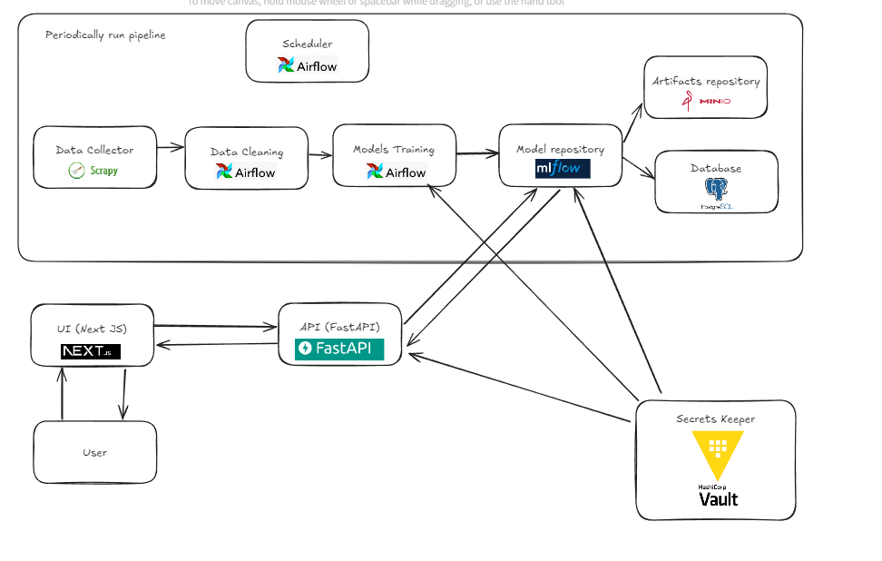

# Overview
This is API part of this whole infrastructure

## Architecture 
Below diagram shows current architecture of the whole application (it consists of several parts). Each of those are self hosted on VMs

## Connected projects

- [Data Collectors](https://github.com/projects-mk/data-collectors) 
- [Airflow Pipelines](https://github.com/projects-mk/airflow-data-pipelines)
